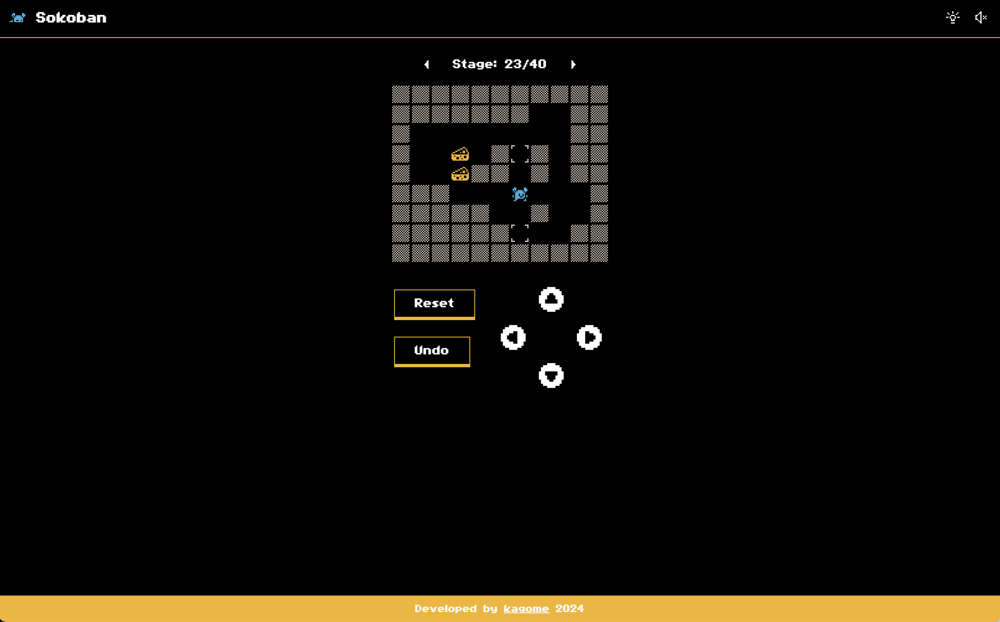

# 倉庫番 _Sokoban_

## 概要

昔ながらの倉庫番ゲームです。ごく簡単ですが、遊び方は画面右上の 💡 に記しています。

## 特徴

- UI にこだわって製作しました。
  - スマホでも遊べるよう、矢印ボタンを配置しました。
  - PC ではマウスを使わず矢印キーで移動、R キーでリセット、Backspace でひとつ戻る、という操作ができます。
- プレイヤー移動の判別にビット演算を利用しました。
  - 2 進数に触れるのは初めてだったためどうなるかと思いましたが、2 進数の基礎から学ぶことでなんとかなりました。
  - 学んだことを忘れないよう、該当部分のコメントは詳しく記述しています。
- マップデータは Aymeric du Peloux さんの Minicosmos をお借りしました。
  - 最初はよくあるマップデータ（レベルが上がるとマップが広がり荷物の数が増えるタイプ）を使用する予定でした。
  - しかし、後半に作業感が出てしまうこと、スマートフォンで表示するとマップが小さくなってしまうことがネックで、小さくても難しいマップはないか、と探していたところ、Minicosmos を見つけました。
  - Minicosmos は全部で 40 題あり、すべて載せるには多すぎるな、と思ったのですが、40 題で Minicosmos なんだろうなと感じたので、すべて載せることにしました。

## 開発メモ

[MEMO.md](https://github.com/kagomen/sokoban/blob/main/MEMO.md)

## 開発時期

2024 年 5 月 3 日〜5 月 7 日

## 使用素材

- マップデータ

  - https://aymericdupeloux.wixsite.com/sokoban/post/5-staple-items-for-autumn

- 画像

  - https://kenney-assets.itch.io/1-bit-pack
  - https://kenney-assets.itch.io/1-bit-pixel-input-prompts-16
  - https://icon-sets.iconify.design/pixelarticons/?keyword=pixel

- フォント

  - https://sysl.itch.io/role-playing-fonts-iii

- サウンド
  - https://coloralpha.itch.io/50-menu-interface-sfx
  - https://seadenden-8bit.com/
